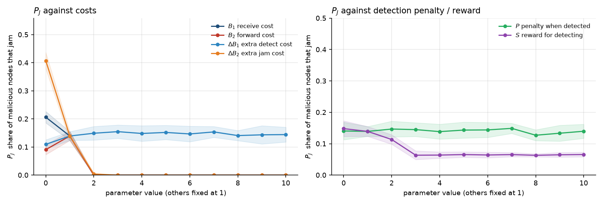

# wsngame

[](https://github.com/specialone0007/wsnGameTheory/actions/workflows/ci.yml)


A vectorised simulation of the **jamming game in wireless sensor networks** from Mao, Zhu & Wei
(2013). Normal nodes forward, receive, detect or sleep; malicious nodes forward, receive, jam or
sleep; every node pays for its action once and earns from each neighbour according to what the
two of them did. The question the paper asks: how does the share of malicious nodes that choose
to jam, $P_J$, depend on the costs and penalties?

Started as a Sabancı University CS535 (Wireless Network Security) replication in 2022. Rewritten
in 2026 as a NumPy package with a proper evolutionary dynamic, tests and CI; the 2022 script,
its outputs, report and slides are kept in [`legacy/`](legacy/) and [`docs/legacy/`](docs/legacy/).



## Model

Actions are coded `F` forward, `D/J` detect (normal) or jam (malicious), `R` receive, `S` sleep.
Per round, a node's payoff is

```
payoff(u) = − cost[type(u), action(u)] + Σ_{v ∈ N(u)} gain[type(u), action(u), type(v), action(v)]
```

| action | cost, paid once | earns per neighbour |
|---|---|---|
| Forward | B₂ | a_F·Y from each neighbour that receives |
| Receive | B₁ | (1−a_F)·Y from each forwarding neighbour; −(1−a_F)·Y per jamming neighbour |
| Detect (normal) | B₁ + ΔB₁ | S per jamming neighbour |
| Jam (malicious) | B₂ + ΔB₂ | a_J·Y per receiving neighbour; −P per detecting neighbour |
| Sleep | 0 | 0 |

Paying each cost *once* rather than once per pairwise game is what the paper's "spatial
structured game" rules (its Fig. 3) come down to. The receiver's (1−a_F)·Y term is an addition
to the paper's pairwise table, explained under *Latest improvements*.

Networks: 1,000 nodes, mean degree 8, 10 % malicious, simple random graph with every node of
degree ≥ 1. Defaults: every cost/penalty/reward 1, Y = 1, a_F = 0.75, a_J = 1, as in the paper.

## Two ways to get P_J

- **best-response** (default). Each generation every node computes what each of its four
  actions *would* have paid given its neighbours' last actions and switches to the best one
  with probability 0.5. After 200 generations, $P_J$ is the mean share of malicious nodes jamming
  over the next 50. Normal nodes react to jammers, so the model has feedback.
- **sampled**. The 2022 scheme: every node acts uniformly at random each round; after 250
  rounds each malicious node is credited with the action whose mean payoff was highest, and
  $P_J$ is the share credited with Jam. No feedback at all.

Both average over the same 20 random networks per parameter value (seed 42).

## Results

`results/best-response/*.csv`, plotted above:

| parameter swept (others = 1) | $P_J$ at 0 | at 1 | at 2 | at 10 | direction | paper |
|---|---:|---:|---:|---:|---|---|
| ΔB₂ extra cost of jamming | 0.41 | 0.14 | 0.00 | 0.00 | ↓ | ↓ |
| B₂ forward/jam base cost | 0.09 | 0.14 | 0.00 | 0.00 | ↓ (after 1) | ↓ |
| B₁ receive cost | 0.21 | 0.14 | 0.00 | 0.00 | ↓ | **↑** |
| ΔB₁ extra cost of detecting | 0.11 | 0.14 | 0.15 | 0.14 | flat / slight ↑ | ↑ |
| S reward for detecting | 0.15 | 0.14 | 0.11 | 0.07 | ↓ | — |
| P penalty when detected | 0.14 | 0.14 | 0.15 | 0.14 | flat | — |

"paper" is the direction reported in the 2013 paper as summarised in the 2022 report; the
report's text does not state a direction for P and S, hence the dashes.

Three things to read off this.

- **Jamming is a knife-edge decision.** At the defaults about 14 % of malicious nodes jam. Make
  jamming one unit dearer (ΔB₂ or B₂ = 2) and nobody jams; make it free and 41 % do. With
  mean degree 8 and a quarter of neighbours receiving, a jammer earns about 2·a_J·Y = 2 per
  round, so the cliff sits exactly where the jam cost B₂ + ΔB₂ crosses 2.
- **B₁ is where the two models differ.** The paper reports more jamming when receiving gets
  dearer. In this model dearer receiving means fewer receivers, so jamming has fewer targets and
  fades. The difference comes from the explicit receiver value, which gives normal nodes a
  reason to stop receiving; it is a clearly identified modelling choice, documented in the
  table above, and a natural next experiment is to vary it.
- **Feedback is what makes the curves.** Under the sampling scheme without feedback
  (`results/sampled/`, [`docs/figures/pj-sampled.png`](docs/figures/pj-sampled.png)),
  neighbours never react, forwarding pays 0.5 per round and jamming −1.8 at every parameter
  value, so $P_J$ is flat at zero. The best-response dynamic is what lets costs and penalties
  show their effect.

## Run it

```bash
pip install -e ".[dev]"
pytest                                       # 12 tests, < 1 s
wsngame sweep                                # 6 parameters × 11 values × 20 networks, ~2 min
wsngame sweep --method sampled               # the 2022 scheme, for comparison
wsngame sweep --params dB2 P --networks 50 --transient 500 --measure 100
wsngame plot results/best-response/*.csv --out docs/figures/pj-best-response.png
```

```python
import numpy as np
from wsngame import Params, random_network, evolve, round_payoffs

rng = np.random.default_rng(0)
net = random_network(n=1000, n_edges=4000, n_malicious=100, rng=rng)
evolve(net, Params(dB2=0.0), rng)          # -> P_J for one network, e.g. 0.41
```

## Layout

```
src/wsngame/
  network.py     random simple graph as directed edge arrays; malicious subset
  game.py        Params, cost/gain tables, round_payoffs (vectorised over edges)
  dynamics.py    candidate_payoffs, best_response_step, evolve
  simulate.py    Config, the two P_J protocols, sweep()
  plots.py       the sweep figure
  cli.py         wsngame sweep | plot
tests/           12 tests: graph invariants, payoff tables against the paper, hand-computed
                 triangle, cost-paid-once, dynamics extremes, monotone sweeps
results/         CSVs for both methods
docs/figures/    the two figures
docs/legacy/     2022 report and slides
legacy/          2022 script and its output files, unchanged
```

## Latest improvements (2026 rewrite)

The 2022 script (`legacy/Implementation/gameTheory.py`) established the qualitative picture.
The rewrite keeps its game and parameters and upgrades the machinery around them.

- **A value for receiving.** In the paper's pairwise table receiving costs B₁ and the value of
  a delivered packet is implicit. The rewrite makes it explicit: the receiver earns (1−a_F)·Y
  per forwarding neighbour and loses it to each jamming neighbour. This is the one addition to
  the paper's table, and it is what gives every adaptive dynamic a non-trivial equilibrium.
- **Payoffs as lookup tables.** Costs and gains are two NumPy arrays indexed by node type and
  action, applied over the edge arrays in one pass. The three-node spatial rules become
  "pay each cost once", which is what they encode.
- **A dynamic with feedback.** Myopic best response with inertia replaces uniformly random
  actions, so normal nodes react to jammers and $P_J$ responds to costs and penalties. The
  sampling scheme is kept behind `--method sampled` for comparison.
- **A clean statistic.** $P_J$ is the plain share of malicious nodes jamming, averaged over
  the measurement window and over networks, with standard deviations in the CSVs.
- **Tests for every assumption**: payoff tables against the paper's formulas, a hand-computed
  triangle, cost-paid-once, best-response optimality, monotone sweeps.

## Reference

Y. Mao, P. Zhu, G. Wei (2013): the game-theoretic WSN security model this repository
replicates. Full citation, the payoff table and the original figures are in the 2022 report,
[`docs/legacy/`](docs/legacy/).

## License

MIT. 2022 project by Furkan Reha Tutaş (CS535, Sabancı University); 2026 rewrite by the same.
